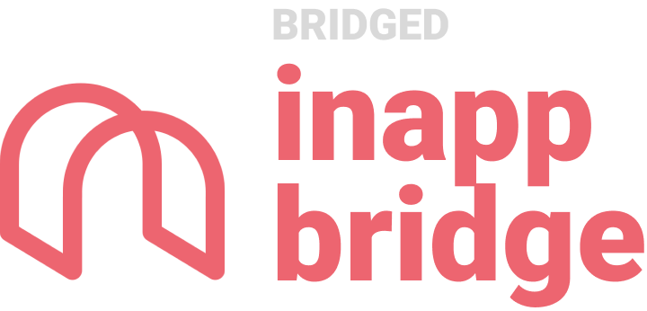

# In App Bridge - "Native Cross platform webview made easy."

Bridge for Web & Native apps for seamless integration and inter communication.

* Android Native (*until 2020.1*)
* iOS Native (*until 2020.2*)
* Flutter (*until 2020.3*)
* Web (VanillaJS & React JS) (*until 2020.1*)
  * can be used for vueJS/Angular with unofficial support


## What is `In App Bridge`?

while you develop apps for both android and ios platform, you will face a stage that you need to use webview for faster development. you can try developing web app for embedding into native app's webview without any tools. but you will relise that that work is not pleasant. iOS/Android will require different interface for communicating to your web app. 

Also when you need platform specific logic on your webapp, you will find it annoying.

**Inappbridge provides interface between web/android and web/iOS**

* Fully reusable web
* Faster webview integration
* Web stays as web. supports both for plain browser & app's page as hybrid


## How to use

ReactJS Example

```typescript
this.props.inAppBridge.pushPage() // pushes new page of native app
this.props.inAppBridge.dismiss() // dismiss current page of native app
this.props.inAppBridge.subscribeTo(channel: "channelA", onMessage: this.handleMessageFromNative)
```


Android Example

```kotlin
InAppBridgeWebviewHandler handler = new InAppBridgeWebviewHandler()
handler.with(webview)

handler.postMessage("message from native to webview") // send simple message to webview
handler.publishTo(channel: "channelA", message: "message from native to webview") // send simple message to webview
handler.authenticate(jwt:"eJX...") // authenticate webview via native app's token
handler.setResult(true) // send positive action to webview
```


iOS Example

```swift
InAppBridgeWebviewHandler handler = new InAppBridgeWebviewHandler()
handler.with(webview)

handler.postMessage("message from native to webview") // send simple message to webview
handler.authenticate(jwt:"eJX...") // authenticate webview via native app's token
handler.setResult(true) // send positive action to webview
```


## How to contribute

If you are interested in contributing to this project. please contact woojoo@softmarshmallow.com